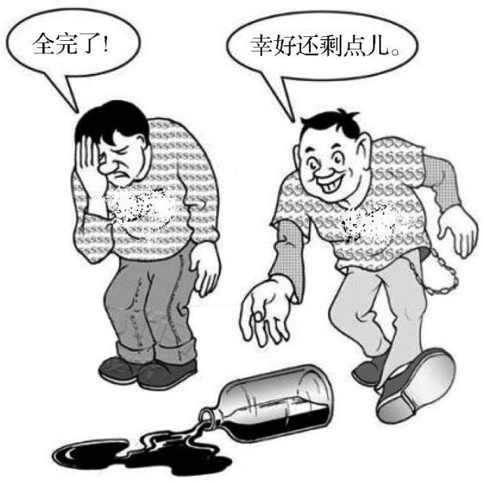

# 2012 English I — Section III Part B

### Passage

Directions：

Write an essay of 160-200 words based on the following drawing. In your essay you should

describe the drawing briefly

explain its intended meaning, and

give your comments.

You should write neatly on ANSWER SHEET 2. (20 points)

---

### Question 52

Write an essay of 160-200 words based on the following drawing. In your essay you should describe the drawing briefly, explain its intended meaning, and give your comments.

**Answer key / reference answer:**

As is vividly shown in the drawing, a bottle has fallen to the ground and part of its contents has spilled out. Faced with the same scene, two men react in completely different ways. One complains in despair that everything is gone, while the other feels relieved that some is still left. The contrast reveals how differently people may interpret the same setback.

The picture reminds us that attitude can strongly influence our response to difficulties. A negative mindset tends to magnify losses and make us overlook what remains, whereas an optimistic outlook helps us recognize available resources and possible solutions. Optimism does not mean denying problems. Rather, it means accepting reality while still looking for a constructive way forward.

In study, work and daily life, setbacks are unavoidable. When difficulties arise, we should examine them calmly, learn from what has happened and make use of what is still in our hands. A positive and realistic attitude can give us the confidence to recover and continue moving ahead.

**Analysis:**

参考范文（非官方标准答案）。范文完整覆盖图画描述、寓意阐释和个人评论，并满足160–200词要求。

<!-- q_id=2012-eng1-writing_b-q52; difficulty=3; score=20.0 -->
