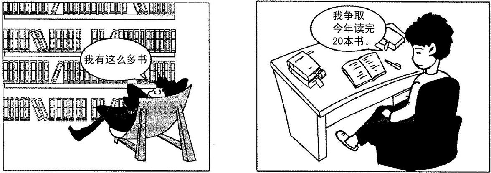

# 2017 English I — Section III Part B

### Passage

Directions:

Write an essay of 160-200 words based on the following pictures. In your essay, you should

describe the pictures briefly,

interpret the meaning, and

give your comments.

You should write neatly on the ANSWER SHEET.

---

### Question 52

Write an essay of 160-200 words based on the following pictures. In your essay, you should describe the pictures briefly, interpret the meaning, and give your comments.

**Answer key / reference answer:**

The two pictures present a sharp contrast in attitudes toward reading. In the first, a man sits beside a large pile of books and proudly says that he owns many of them. In the second, another man is absorbed in reading a single book. The message is clear: possessing books is not the same as gaining knowledge from them.

Today, buying books has become easier than ever, and many people enjoy collecting attractive volumes or sharing reading lists online. Yet books have value only when we actually open them, think about their ideas and apply what we learn. A small number of books read carefully can be far more useful than a huge collection left untouched.

For students, this contrast is especially meaningful. Instead of pursuing the appearance of being well read, we should develop a steady reading habit, take notes, question the author and connect new knowledge with our own experience. Genuine learning depends not on how many books stand on a shelf, but on how deeply we engage with them.

**Analysis:**

范文点评：
1. 内容切题：范文紧扣题目要求，清晰描述了图片内容，深刻阐释了“有书”和“读书”的含义，并提出了个人观点。
2. 结构完整：文章结构清晰，分为描述图片、解释含义和发表评论三个部分，逻辑连贯。
3. 语言流畅：范文用词准确，句式多样，语言表达流畅自然，符合英语写作规范。
4. 思想深刻：范文不仅停留在表面描述，更深入探讨了读书的意义和价值，提出了深刻的见解。

写作思路分析：
1. 描述图片：用简洁明了的语言概括图片内容，抓住图片的主要特征。
2. 解释含义：从图片入手，引申到社会现象，分析“有书”和“读书”的本质区别，可以结合名言警句或个人经历进行论证。
3. 发表评论：结合自身实际，谈谈对读书的看法，提出合理建议，呼吁大家注重读书的质量而非数量。

<!-- q_id=2017-eng1-writing_b-q52; difficulty=3; score=20.0 -->
