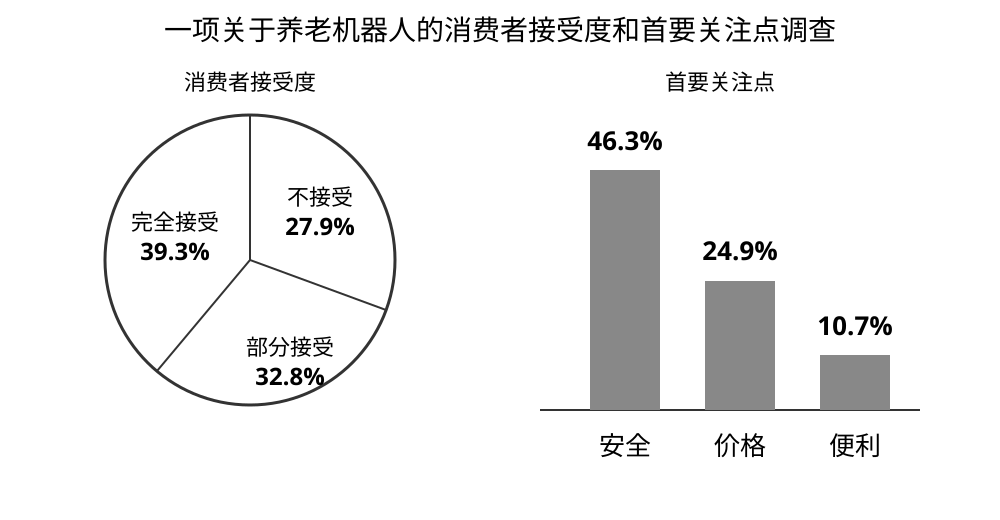

# 2026 English I — Section III Part B

### Passage

Write an essay based on the charts below. In your essay you should

1) describe the charts briefly,
2) interpret the charts, and
3) give your comments.

Write your answer in 160–200 words on the ANSWER SHEET. (20 points)

Chart data — A survey on consumers’ acceptance of eldercare robots and their primary concerns:
- Acceptance: fully accept 39.3%; partially accept 32.8%; do not accept 27.9%.
- Primary concerns: safety 46.3%; price 24.9%; convenience 10.7%.

---

### Question 52

Write an essay based on the charts below. In your essay you should

1) describe the charts briefly,
2) interpret the charts, and
3) give your comments.

Write your answer in 160–200 words on the ANSWER SHEET. (20 points)

Chart data — A survey on consumers’ acceptance of eldercare robots and their primary concerns:
- Acceptance: fully accept 39.3%; partially accept 32.8%; do not accept 27.9%.
- Primary concerns: safety 46.3%; price 24.9%; convenience 10.7%.

**Answer key / reference answer:**

The charts present a survey of consumers’ attitudes toward eldercare robots. Overall, 39.3% of respondents fully accept such robots and another 32.8% partially accept them, while 27.9% do not. Among the concerns reported, safety ranks first at 46.3%, followed by price at 24.9% and convenience at 10.7%.

These figures suggest that eldercare robots already enjoy considerable public acceptance, probably because they may reduce repetitive care work, provide timely assistance and help older people live more independently. At the same time, the prominence of safety concerns shows that consumers will not embrace the technology simply because it is novel. Reliability, privacy protection and emergency handling are essential when machines work closely with vulnerable users.

Therefore, developers and policymakers should focus first on strict safety standards, transparent testing and affordable pricing. Eldercare robots should also be designed as assistants rather than replacements for human caregivers. If technological efficiency is combined with dependable protection and genuine human care, these robots can become a useful part of an aging society.

**Analysis:**

参考范文（非官方标准答案）。范文先准确概括两组数据，再解释公众接受度与安全顾虑，最后提出规范、安全与人机协作建议；正文控制在160–200词。

<!-- q_id=2026-eng1-writing_b-q52; difficulty=3; score=20.0 -->
