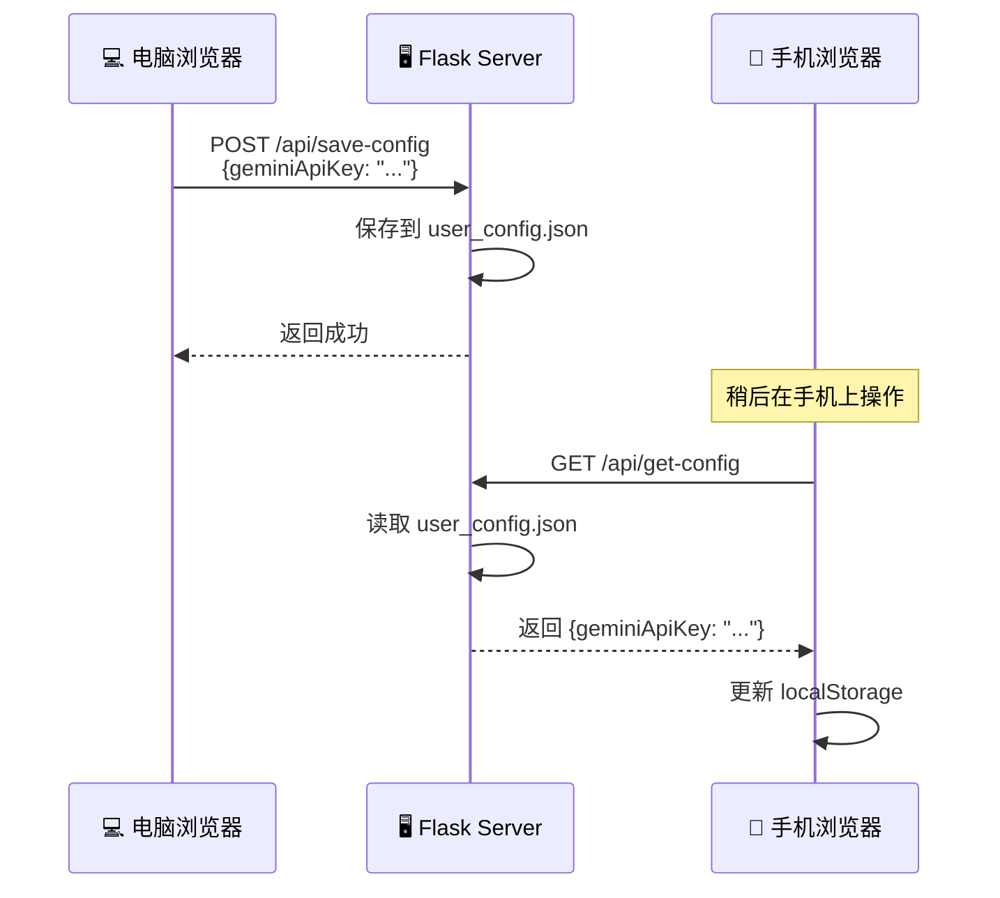

# 📱 API Key 多设备配置指南

## 问题说明

手机浏览器的密码输入框通常：
- ❌ 无法粘贴内容（安全限制）
- ❌ 自动填充不可用
- ❌ 输入 40+ 字符的 API Key 容易出错

## ✅ 解决方案

### 方案 1：电脑配置 + 手机同步（推荐）⭐

**最简单的方式，90% 用户的选择**

#### 电脑端操作
```
1. 打开 http://localhost:8080
2. 点击"⚙️ 设置"
3. 输入 Gemini API Key
4. 点击"💾 保存设置"
```

✅ **自动完成**：API Key 会自动保存到服务器

#### 手机端操作
```
1. 打开 http://你的电脑IP:8080
2. 点击"⚙️ 设置"
3. 点击"🔄 同步配置"
4. 完成！
```

---

### 方案 2：显示密码 + 手动输入

#### 适用场景
- 没有电脑在旁边
- 只用手机学习
- 需要临时修改 API Key

#### 操作步骤
```
1. 打开设置页面
2. 在 API Key 输入框右侧点击"👁️"按钮
3. 密码框变成文本框（可见）
4. 仔细逐字符输入 API Key
5. 再次点击"🙈"按钮隐藏
6. 保存设置
```

**提示**：
- 👁️ = 显示密钥（可见）
- 🙈 = 隐藏密钥（不可见）
- 切换到可见模式后可以检查输入是否正确

---

### 方案 3：文件导入（适合开发者）

#### 使用场景
- 多台设备需要配置
- 批量部署
- 自动化脚本

#### 操作步骤
1. 在服务器目录创建 `user_config.json`：
```json
{
  "geminiApiKey": "AIza你的完整API密钥",
  "lastModified": "2025-12-13T12:00:00"
}
```

2. 在任意设备上点击"🔄 同步配置"

---

## 🔒 安全说明

### 什么会同步？
- ✅ API Key（存储在服务器的 `user_config.json`）
- ✅ 学习数据（存储在 `user_vocab.db`）

### 什么不会同步？
- ⚙️ 每日目标（存储在浏览器 localStorage）
- ⚙️ 通知设置（存储在浏览器 localStorage）
- ⚙️ 界面偏好（存储在浏览器 localStorage）

### 数据存储位置

| 数据类型 | 存储位置 | 是否同步 | 安全性 |
|---------|---------|---------|--------|
| API Key | 服务器 user_config.json | ✅ 是 | 🔒 本地网络 |
| 学习记录 | 服务器 user_vocab.db | ✅ 是 | 🔒 本地网络 |
| 每日目标 | 浏览器 localStorage | ❌ 否 | 📱 设备隔离 |
| 通知设置 | 浏览器 localStorage | ❌ 否 | 📱 设备隔离 |

---

## 🆘 常见问题

### Q1: 点击"同步配置"提示"服务器上没有保存配置"
**原因**：电脑端还没有配置过 API Key

**解决**：
1. 先在电脑上打开设置
2. 输入 API Key 并保存
3. 再在手机上同步

---

### Q2: 手机无法连接到服务器
**检查清单**：
- [ ] 手机和电脑在同一个 Wi-Fi 网络
- [ ] 服务器正在运行（`python server.py`）
- [ ] 使用正确的 IP 地址（在服务器启动时会显示）
- [ ] 防火墙没有阻止 8080 端口

**测试连接**：
```
手机浏览器访问: http://电脑IP:8080/api/status
应该看到服务器状态信息
```

---

### Q3: 同步后 API Key 没有生效
**解决步骤**：
1. 检查输入框是否已显示 API Key
2. 手动点击"💾 保存设置"
3. 刷新页面（F5 或下拉刷新）
4. 查看浏览器控制台是否有错误

---

### Q4: 想要更换 API Key
**操作方法**：

**电脑端**：
1. 点击"👁️"按钮显示当前密钥
2. 全选删除后输入新密钥
3. 保存设置

**手机端**：
1. 在电脑上更换后
2. 手机点击"同步配置"
3. 或者使用"显示密码"功能手动输入

---

## 💡 最佳实践

### 推荐工作流

```
初次配置（一次性）:
电脑: 输入 API Key → 保存设置
手机: 打开应用 → 同步配置 → 完成

日常使用:
电脑: 直接学习（配置已保存）
手机: 直接学习（配置已同步）
```

### 配置检查

在设置页面确认：
- ✅ API Key 输入框有内容（显示 ••••••）
- ✅ "AI讲解"按钮可以正常使用
- ✅ 点击后能生成讲解内容

---

## 🔧 技术原理

### 同步流程



### 数据流向

```
保存设置:
  用户输入 → localStorage (立即) → 服务器 (异步)

同步配置:
  服务器 → 用户界面 → localStorage
```

### API 接口

| 接口 | 方法 | 说明 |
|------|------|------|
| `/api/save-config` | POST | 保存配置到服务器 |
| `/api/get-config` | GET | 从服务器获取配置 |
| `/api/save-db` | POST | 保存学习数据 |
| `/api/get-db` | GET | 获取学习数据 |
| `/api/status` | GET | 服务器状态检查 |

---

## 📚 相关文档

- [README.md](README.md) - 完整使用指南
- [CONFIG.md](CONFIG.md) - 详细配置说明
- [DATA_SYNC.md](DATA_SYNC.md) - 数据同步原理

---

<div align="center">

**🎯 配置一次，处处使用！**

有问题？查看 [常见问题](README.md#常见问题) 或提交 Issue

</div>
