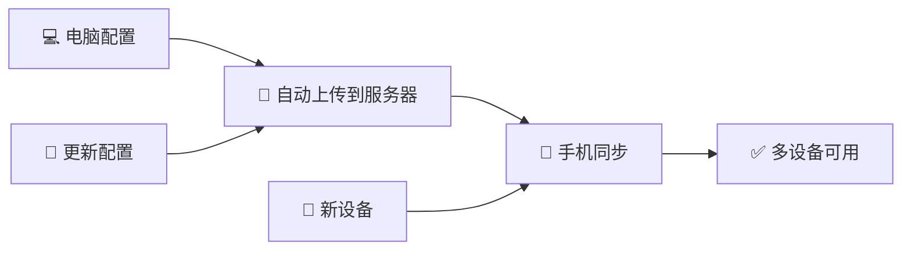

# 🎉 VocabWeb v2.2.0 更新说明

## 📱 解决手机端 API Key 输入难题

### 🔥 新增功能

#### 1. API Key 配置同步 ⭐⭐⭐

**问题**：
- ❌ 手机密码框无法粘贴
- ❌ 手动输入 40+ 字符容易出错
- ❌ 每个设备都要重复配置

**解决**：
```
电脑端配置 → 一键同步 → 手机立即可用
```

**操作流程**：
1. 💻 电脑上输入 API Key 并保存
2. 📱 手机点击"🔄 同步配置"按钮
3. ✅ 完成！无需手动输入

---

#### 2. 显示/隐藏密码按钮 👁️

**解决**：难以确认输入是否正确

**功能**：
- 点击 👁️ 按钮显示密钥（可见）
- 再次点击 🙈 按钮隐藏密钥
- 方便检查输入是否正确

---

#### 3. 配置服务器 API

新增两个 REST API：

| 接口 | 方法 | 说明 |
|------|------|------|
| `/api/save-config` | POST | 保存配置到服务器 |
| `/api/get-config` | GET | 从服务器获取配置 |

**数据存储**：
- 文件：`user_config.json`
- 格式：JSON
- 安全：本地网络内传输

---

## 🔧 文件变更

### 新增文件
```
VocabWeb/
├── API_KEY_SETUP.md        # API Key 配置详细教程
├── test-api-key.html       # 功能测试页面
└── user_config.json        # 配置存储（自动生成）
```

### 修改文件
```
VocabWeb/
├── index.html              # 添加显示/隐藏按钮和同步按钮
├── js/app.js               # 添加配置同步逻辑
├── css/style.css           # 添加按钮样式
├── server.py               # 添加配置同步 API
├── .gitignore              # 排除 user_config.json
└── README.md               # 添加 API Key 配置说明链接
```

---

## 📚 使用指南

### 场景 1：首次配置（电脑 + 手机）

#### 电脑端
```
1. 访问 http://localhost:8080
2. 点击 ⚙️ 设置
3. 输入 Gemini API Key
4. 点击 💾 保存设置
```

✅ **自动完成**：API Key 会自动保存到服务器的 `user_config.json`

#### 手机端
```
1. 访问 http://电脑IP:8080
2. 点击 ⚙️ 设置
3. 点击 🔄 同步配置
4. 系统自动填充 API Key
5. 点击 💾 保存设置
```

✅ **完成**：手机端现在可以使用 AI 讲解功能了！

---

### 场景 2：仅手机配置（无电脑）

```
1. 在 API Key 输入框右侧点击 👁️ 按钮
2. 密码框变成可见文本框
3. 仔细输入 API Key（可以看到每个字符）
4. 再次点击 🙈 按钮隐藏
5. 点击 💾 保存设置
```

---

### 场景 3：更新 API Key

**方法 A - 电脑端更新**：
```
电脑: 显示密码 → 全选删除 → 输入新密钥 → 保存
手机: 点击同步配置 → 完成
```

**方法 B - 直接修改配置文件**：
```bash
# 编辑 VocabWeb/user_config.json
{
  "geminiApiKey": "新的API密钥",
  "lastModified": "2025-12-13T12:00:00"
}

# 所有设备点击"同步配置"
```

---

## 🧪 测试功能

### 测试页面

访问 `http://localhost:8080/test-api-key.html`

**测试内容**：
- ✅ 保存配置到服务器
- ✅ 从服务器同步配置
- ✅ 显示/隐藏密码功能
- ✅ 服务器状态检查

---

## 🔒 安全说明

### 数据存储位置

| 数据 | 存储位置 | 传输方式 | 安全级别 |
|------|---------|---------|---------|
| API Key | 服务器 user_config.json | HTTP (本地网络) | 🔒 局域网 |
| 学习数据 | 服务器 user_vocab.db | HTTP (本地网络) | 🔒 局域网 |
| 界面配置 | 浏览器 localStorage | 无 | 📱 本地 |

### 安全建议

✅ **推荐做法**：
- 仅在家庭/学校内网使用
- 不要在公共 Wi-Fi 下同步
- 定期更新 API Key

❌ **不推荐**：
- 将服务器暴露到公网
- 在不信任的网络中使用
- 共享 API Key

---

## 🐛 已知问题

### 浏览器兼容性

| 浏览器 | 显示/隐藏按钮 | 配置同步 | 状态 |
|--------|-------------|---------|------|
| Chrome (PC) | ✅ | ✅ | 完美 |
| Edge (PC) | ✅ | ✅ | 完美 |
| Firefox (PC) | ✅ | ✅ | 完美 |
| Safari (iOS) | ✅ | ✅ | 完美 |
| Chrome (Android) | ✅ | ✅ | 完美 |
| Firefox (Android) | ✅ | ✅ | 完美 |
| Edge (Mobile) | ✅ | ⚠️ | 密码框限制较多 |

⚠️ **Edge Mobile 注意**：部分安卓版 Edge 浏览器对密码框有额外限制，建议使用 Chrome 或 Firefox。

---

## 📈 性能优化

### 同步机制

- 🚀 **轻量级**：配置文件 < 1 KB
- ⚡ **快速**：本地网络响应 < 100ms
- 💾 **自动保存**：配置更改立即保存到服务器
- 🔄 **增量同步**：只传输必要数据

---

## 🆙 升级指南

### 从 v2.1.0 升级到 v2.2.0

**自动升级**：
```bash
git pull origin main
# 无需额外操作，直接启动
python server.py
```

**手动升级**：
1. 备份 `user_vocab.db`（如果存在）
2. 下载新版本文件
3. 覆盖旧文件
4. 启动服务器

**数据迁移**：
- ✅ 学习数据自动保留
- ✅ 配置可重新设置
- ⚠️ API Key 需要重新配置

---

## 💡 最佳实践

### 推荐工作流



### 配置检查清单

- [ ] 服务器已启动
- [ ] 电脑端已配置 API Key
- [ ] 手机端成功同步
- [ ] AI 讲解功能正常
- [ ] 测试页面无错误

---

## 🎯 未来计划

### v2.3.0（计划中）

- [ ] 二维码扫描配置（手机扫码即可配置）
- [ ] 批量设备管理（管理多台设备）
- [ ] 配置版本控制（回滚到历史配置）
- [ ] 加密传输（HTTPS 支持）

---

## 📞 支持

### 问题反馈

- 🐛 Bug 报告：[GitHub Issues](https://github.com/tmzncty/EnglishExamRPG/issues)
- 💬 使用讨论：[GitHub Discussions](https://github.com/tmzncty/EnglishExamRPG/discussions)
- 📧 邮件联系：tmzncty@example.com

### 相关文档

- [README.md](README.md) - 完整使用指南
- [API_KEY_SETUP.md](API_KEY_SETUP.md) - API Key 配置详解
- [CONFIG.md](CONFIG.md) - 配置文件说明
- [DATA_SYNC.md](DATA_SYNC.md) - 数据同步原理

---

<div align="center">

**🎉 感谢使用 VocabWeb！**

[⭐ Star on GitHub](https://github.com/tmzncty/EnglishExamRPG) | 
[📖 查看文档](README.md) | 
[🐛 报告问题](https://github.com/tmzncty/EnglishExamRPG/issues)

**祝你考研成功！🎓**

</div>
