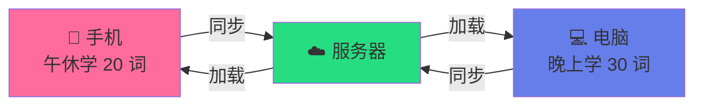

# 🎯 VocabWeb - 智能词汇学习系统

<div align="center">

[](LICENSE)
[](https://www.python.org/)
[](https://flask.palletsprojects.com/)
[](https://github.com/tmzncty/EnglishExamRPG)

**基于遗忘曲线的考研英语词汇学习应用 | 支持多设备数据同步**

[功能特性](#-核心特性) •
[快速开始](#-快速开始) •
[使用教程](#-使用教程) •
[文档](#-文档)


</div>

---

## ✨ 核心特性

<table>
<tr>
<td width="33%" align="center">

### 🔄 跨设备同步
手机、电脑、平板<br/>
学习进度实时共享<br/>
**随时随地继续学习**

</td>
<td width="33%" align="center">

### 🧠 科学记忆
SuperMemo 2 算法<br/>
遗忘曲线管理<br/>
**高效记忆不遗忘**

</td>
<td width="33%" align="center">

### 📚 真题语境
2010-2025 年真题<br/>
6131 个核心词汇<br/>
**学以致用印象深**

</td>
</tr>
<tr>
<td width="33%" align="center">

### 📋 智能错题本
自动收集错题<br/>
连续答对 3 次移出<br/>
**查漏补缺不放过**

</td>
<td width="33%" align="center">

### 🤖 AI 讲解
Gemini 2.0 驱动<br/>
词根词缀记忆法<br/>
**深度理解更牢固**

</td>
<td width="33%" align="center">

### ⚙️ 灵活配置
每设备独立设置<br/>
数据统一同步<br/>
**个性化学习方案**

</td>
</tr>
</table>

---

## 🎮 多设备协同学习

<div align="center">



**今日目标 50 词 = 手机 20 词 + 电脑 30 词**

✅ 数据实时同步 | ✅ 不重复学习 | ✅ 进度自动累加

</div>

---

## ⚡ 快速开始

### 一键启动（Windows）

```bash
# 1. 克隆项目
git clone https://github.com/tmzncty/EnglishExamRPG.git
cd EnglishExamRPG/VocabWeb

# 2. 双击启动
start.bat

# 3. 浏览器访问
# 电脑: http://localhost:8080
# 手机: http://你的电脑IP:8080
```

### 命令行启动

```bash
# 安装依赖
pip install -r requirements.txt

# 启动服务器
python server.py

# 看到以下信息表示成功：
# 🚀 VocabWeb 服务器启动中...
# 📱 支持跨设备数据同步
# 🌐 访问地址: http://localhost:8080
# 🌐 手机访问: http://192.168.x.x:8080
```

---

## 📱 使用教程

### 1️⃣ 首次使用

<table>
<tr>
<td width="50%">

**电脑端设置**
1. 访问 `http://localhost:8080`
2. 点击右上角 ⚙️ 设置
3. 配置每日目标（建议 50 个）
4. 开始学习！

</td>
<td width="50%">

**手机端设置**
1. 确保与电脑同一 Wi-Fi
2. 访问 `http://192.168.x.x:8080`
3. 配置每日目标（建议 20 个）
4. 添加到主屏幕（可选）

</td>
</tr>
</table>

### 2️⃣ 多设备协同

```
早上 08:00 (手机)
  → 地铁上学了 10 个单词 ✅
  
中午 12:00 (手机)
  → 午休又学了 10 个单词 ✅
  → 累计完成 20/50
  
晚上 20:00 (电脑)
  → 打开页面，显示已学 20 个
  → 继续学习剩余 30 个 ✅
  → 完成今日目标 50/50 🎉
```

### 3️⃣ 学习流程

```
查看真题例句 → 选择正确释义 → 查看答案
             ↓
      答错进入错题本 ← 连续答对 3 次移出
             ↓
      AI 智能讲解（可选）
             ↓
      上一题 / 下一题 → 完成每日目标
```

---

## 📊 数据同步说明

### ✅ 会同步的数据（所有设备共享）

- 📝 学习记录和进度
- 📚 词汇数据和例句
- ❌ 错题本
- 💬 AI 讲解缓存

### ⚙️ 不会同步的数据（每设备独立）

- 🎯 每日学习目标（手机 20，电脑 50）
- 🔔 通知设置
- 🔑 Gemini API Key

> 💡 **设计理念**：学习数据统一管理，配置文件个性化设置

详见：[DATA_SYNC.md](DATA_SYNC.md)

---

## 🛠️ 技术栈

- **后端**: Flask 3.0 + Python 3.7+
- **前端**: 原生 JavaScript（零框架）
- **数据库**: SQL.js（浏览器 SQLite）
- **同步**: RESTful API + LocalStorage
- **AI**: Gemini 2.0 Flash
- **算法**: SuperMemo 2

---

## 📚 文档

| 文档 | 说明 |
|------|------|
| [README.md](README.md) | 📖 完整项目文档 |
| [CONFIG.md](CONFIG.md) | ⚙️ 配置说明 |
| [DATA_SYNC.md](DATA_SYNC.md) | 🔄 数据同步机制 |
| [USAGE_GUIDE.md](USAGE_GUIDE.md) | 📘 使用指南 |
| [NEW_FEATURES.md](NEW_FEATURES.md) | ✨ 新功能介绍 |

---

## 🎯 推荐使用场景

<table>
<tr>
<td width="33%">

### 碎片时间学习
- 早晨通勤 (📱 10 词)
- 午休时间 (📱 10 词)
- 晚上深度 (💻 30 词)

</td>
<td width="33%">

### 不同设备目标
- 电脑主力学习 (50 词)
- 手机碎片复习 (20 词)
- 平板周末攻坚 (100 词)

</td>
<td width="33%">

### 阶段性策略
- 初期打基础 (20-30 词)
- 中期扩词汇 (40-50 词)
- 冲刺强化 (50-100 词)

</td>
</tr>
</table>

---

## ❓ 常见问题

<details>
<summary><b>Q: 手机无法访问怎么办？</b></summary>

**检查清单**：
1. ✅ 手机和电脑在同一 Wi-Fi
2. ✅ 服务器正在运行
3. ✅ 使用正确的 IP 地址（在服务器输出中查看）
4. ✅ 防火墙允许 8080 端口

**测试方法**：
访问 `http://localhost:8080/test.html` 查看服务器状态
</details>

<details>
<summary><b>Q: 数据会不会丢失？</b></summary>

**不会！** 数据安全保障：
- ✅ 服务器端保存（`user_vocab.db`）
- ✅ 浏览器缓存备份（`localStorage`）
- ✅ 自动备份文件（`user_vocab.db.backup`）
- ✅ 每次答题后立即保存

**建议**：定期手动备份 `user_vocab.db` 文件
</details>

<details>
<summary><b>Q: 可以离线使用吗？</b></summary>

**可以！**
- 有网络：优先使用服务器数据
- 无网络：使用本地缓存
- 恢复网络：自动同步到服务器

**建议**：首次使用时联网，下载预构建数据库
</details>

<details>
<summary><b>Q: 手机和电脑可以同时学习吗？</b></summary>

**可以！这正是跨设备同步的优势！**

- ✅ 学习记录会自动累加
- ✅ 不会重复学习同一个单词
- ✅ 每个设备可设置不同目标
- ⚠️ 建议一个设备学完再用另一个（避免冲突）
</details>

更多问题查看 [USAGE_GUIDE.md](USAGE_GUIDE.md)

---

## 📈 更新日志

### v2.1 (2025-12-13) 🎉 重大更新

**🚀 跨设备数据同步**
- ✅ 新增 Flask 后端服务器
- ✅ 支持手机、电脑、平板多端同步
- ✅ 自动保存（每 30 秒 + 答题后立即）
- ✅ 离线缓存支持

**🎨 界面与体验**
- ✅ 霞鹜文楷等宽字体
- ✅ 服务器测试页面
- ✅ 缓存清除工具

**📚 文档完善**
- ✅ 新增 5 个详细文档
- ✅ 多设备协同学习说明

[查看完整更新日志](README.md#-更新日志)

---

## 🤝 贡献

欢迎贡献代码、提出建议或报告问题！

1. Fork 本项目
2. 创建特性分支 (`git checkout -b feature/AmazingFeature`)
3. 提交更改 (`git commit -m 'Add some AmazingFeature'`)
4. 推送到分支 (`git push origin feature/AmazingFeature`)
5. 提交 Pull Request

---

## 📄 许可证

本项目采用 MIT 许可证 - 详见 [LICENSE](LICENSE) 文件

---

## 🌟 Star History

<div align="center">

[](https://star-history.com/#tmzncty/EnglishExamRPG&Date)

**如果这个项目对你有帮助，请给个 Star ⭐ 支持一下！**

</div>

---

<div align="center">

### 💪 祝你考研成功！

Made with ❤️ by [tmzncty](https://github.com/tmzncty)

[⬆️ 回到顶部](#-vocabweb---智能词汇学习系统)

</div>
